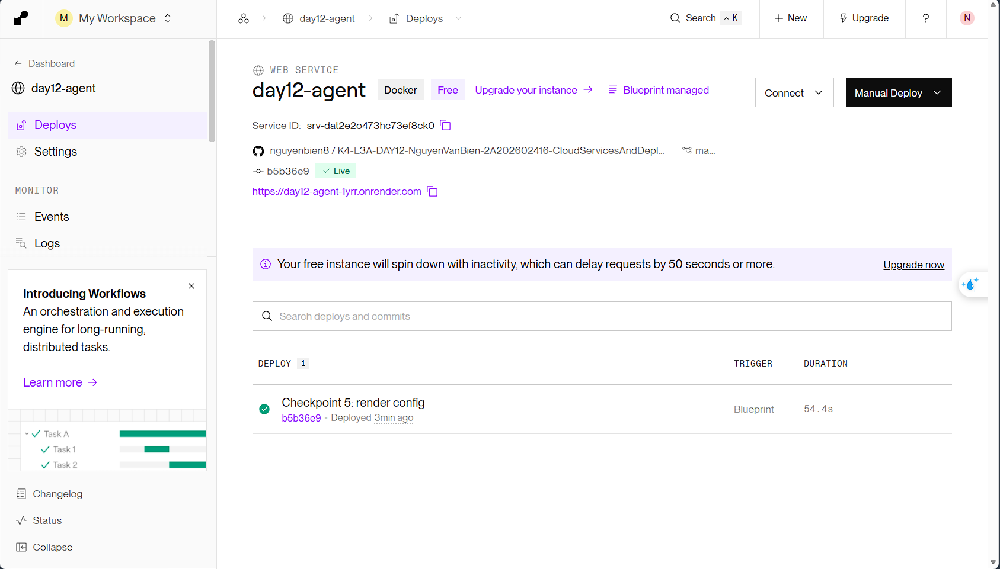
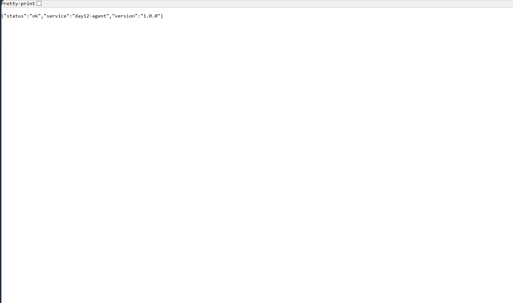

# Thông Tin Deploy — Checkpoint 5

> `pytest tests/test_cp5.py` đọc file này để tìm địa chỉ service và gọi thử.
>
> **Chỉ ghi TÊN biến môi trường, không dán giá trị API key vào đây.**

## Thông Tin Học Viên

| Mục | Nội dung |
|-----|----------|
| Họ và tên | Nguyễn Văn Biển |
| Mã học viên | 2A202602416 |
| Repo | https://github.com/nguyenbien8/K4-L3A-DAY12-NguyenVanBien-2A202602416-CloudServicesAndDeployment |

## Service

| Mục | Nội dung |
|-----|----------|
| Public URL | https://day12-agent-1yrr.onrender.com |
| Platform | Render (Blueprint từ `render.yaml`, runtime Docker, plan Free, region Singapore) |
| Ngày deploy | 2026-09-28 |

Kiến trúc trên Render:

- **day12-agent** — Web Service build từ `Dockerfile` trong repo (multi-stage,
  non-root, `exec uvicorn ... --port ${PORT}`), health check path `/health`.
- **day12-redis** — Render Key Value (tương thích Redis), chỉ truy cập qua
  mạng nội bộ (`ipAllowList: []`), lưu history / rate limit / chi phí.
- Mỗi lần push lên nhánh `main`, Render tự build và deploy lại.

## Biến Môi Trường Đã Set Trên Cloud

Ghi tên biến và **nguồn giá trị**, không ghi giá trị:

| Biến | Đã set | Ghi chú |
|------|--------|---------|
| `PORT` | ✅ | Render tự gán, app đọc qua `${PORT:-8000}` |
| `AGENT_API_KEY` | ✅ | nhập tay khi tạo Blueprint (`sync: false`), không nằm trong repo |
| `REDIS_URL` | ✅ | lấy tự động từ Render Key Value `day12-redis` (`fromService` → `connectionString`) |
| `RATE_LIMIT_PER_MINUTE` | ✅ | 10 (khai báo trong `render.yaml`) |
| `MONTHLY_BUDGET_USD` | ✅ | 10.0 (khai báo trong `render.yaml`) |
| `LOG_LEVEL` | ✅ | INFO (khai báo trong `render.yaml`) |

## Lệnh Kiểm Tra

`DEPLOY_API_KEY` là biến shell ở máy, chứa đúng giá trị `AGENT_API_KEY` đã set
trên Render (đọc từ `.env` cục bộ, không commit).

```bash
URL=https://day12-agent-1yrr.onrender.com

# 1. Liveness — mong đợi 200 {"status":"ok"}
curl -i $URL/health

# 2. Readiness — mong đợi 200 {"status":"ready"} (đã nối được Redis)
curl -i $URL/ready

# 3. Không có API key — mong đợi 401
curl -i -X POST $URL/ask \
  -H "Content-Type: application/json" \
  -d '{"question":"Hello"}'

# 4. Có API key — mong đợi 200 kèm câu trả lời
curl -i -X POST $URL/ask \
  -H "Content-Type: application/json" \
  -H "X-API-Key: $DEPLOY_API_KEY" \
  -H "X-User-Id: sv-test" \
  -d '{"question":"Deploy la gi?"}'

# 5. Rate limit — gọi 15 lần, những lần cuối phải trả 429
for i in $(seq 1 15); do
  curl -s -o /dev/null -w "%{http_code} " -X POST $URL/ask \
    -H "Content-Type: application/json" \
    -H "X-API-Key: $DEPLOY_API_KEY" \
    -H "X-User-Id: sv-test" \
    -d '{"question":"test"}'
done; echo
```

## Kết Quả Chạy Thật

Chạy ngày 2026-09-28 từ máy cá nhân vào bản deploy trên Render:

```
$ curl -i $URL/health
HTTP/1.1 200 OK
{"status":"ok","service":"day12-agent","version":"1.0.0"}

$ curl -i $URL/ready
HTTP/1.1 200 OK
{"status":"ready","redis":true}

$ curl -i -X POST $URL/ask   (không có API key)
HTTP/1.1 401 Unauthorized
{"detail":"invalid or missing API key"}

$ curl -i -X POST $URL/ask   (có API key, X-User-Id: sv-test)
HTTP/1.1 200 OK
{"answer":"Ngắn gọn: Deploy la gi phụ thuộc vào ba yếu tố — cấu hình qua biến môi trường, health check để orchestrator biết trạng thái, và giới hạn tài nguyên.","user_id":"sv-test","history_length":0,"cost_usd":2.265e-05,"tokens":{"in":3,"out":37}}

$ rate limit — 15 lần liên tiếp
200 200 200 200 200 200 200 200 200 429 429 429 429 429 429
```

Rate limit: request có key ở bước 4 đã chiếm 1 lượt trong cửa sổ 60 giây của
`sv-test`, nên vòng lặp nhận 9 lần `200` rồi `429` — đúng hạn mức 10/phút.

## Ảnh Chụp Màn Hình

- `screenshots/dashboard.png` — service `day12-agent` trên Render: Docker, Free,
  Blueprint managed, trạng thái **Live**, Public URL
- `screenshots/health.png` — kết quả gọi `/health` từ trình duyệt




